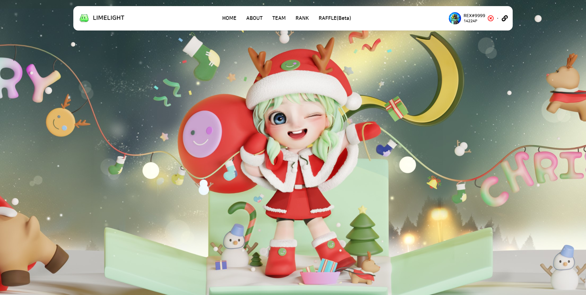

# LIMELIGHT Web Project
> 글로벌 NFT 알파 커뮤니티 웹 프로젝트

<a href="https://limelight.town" target="_blank">https://limelight.town</a>



## 기술스택

#### Frontend
<div>


</div>

#### Backend
<div>


</div>

#### Database
<div>


</div>

## 설치 방법

### Requirements
* Node.js v18.14.0

### Installation
```sh
$ git clone https://github.com/jinha93/limelight.git
```

### Backend
```sh
$ cd server
$ npm install
$ npm run dev
```

### Frontend
```sh
$ cd client
$ npm install
$ npm start
```

## 주요 기능
* ### Discord Login
Discord API를 이용한 Login 구현으로 접근성 향상

* ### MetaMask 지갑 등록
다양한 이벤트 참여를 위해 MetaMask 지갑 등록 가능

* ### 커뮤니티 Point 제도
디스코드 활동 등으로 얻을 수 있는 포인트를 사용하여 Raffle 등 다양한 이벤트에 참여

* ### 홀더 인증 기능 (미구현)
ETH 기반의 LIMEMON NFT 소지 시 홀더 인증 가능
